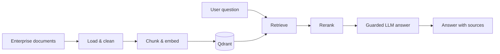

# EnterpriseRAG

<p align="center">
  
</p>

> A work-in-progress, enterprise-oriented Retrieval-Augmented Generation (RAG) system for searching internal documents with grounded AI answers.

> ## 🚧 UNDER CONSTRUCTION 🚧
>
> *“Rome wasn’t built in a day — neither is a reliable enterprise RAG system.”*
>
> This project is actively being built. Expect scaffolding, experiments, and the occasional pile of very intentional technical debt.

[](#project-status)
[](https://www.python.org/)

EnterpriseRAG is being built as a local-first document intelligence pipeline. The goal is to ingest mixed enterprise content, retrieve the most relevant evidence, rerank it, and provide safe, traceable answers through an API and chat interface.

## What exists today

- Environment-based configuration for Gemini, Groq, and Qdrant credentials.
- A reusable HTML loader that removes non-content tags and normalizes extracted text.
- Representative clean and noisy document corpora for ingestion and retrieval experiments.
- Early architecture diagrams for the generic RAG and data-ingestion flows.

The ingestion processor and retrieval service are intentionally present as scaffolds; their implementations are the next active areas of work.

## Explore the project

<details open>
<summary><strong>Current project status</strong></summary>

| Area | Status | Notes |
| --- | --- | --- |
| Configuration | ✅ Started | Reads provider and Qdrant settings from `.env` |
| HTML extraction | ✅ Started | Removes script/style/meta/noscript content |
| Document ingestion | 🚧 In progress | Processor module is scaffolded |
| Chunking & indexing | ⏳ Planned | Target: Qdrant-backed semantic index |
| Retrieval & reranking | 🚧 In progress | Retrieval service is scaffolded; FlashRank is a planned dependency |
| API & chat UI | ⏳ Planned | FastAPI and Streamlit are selected dependencies |
| Guardrails, tracing & evaluation | ⏳ Planned | NeMo, LangSmith/Logfire/Langfuse, RAGAS, and DeepEval are selected |

</details>

<details>
<summary><strong>Repository map</strong></summary>

```text
.
├── app/
│   ├── config.py                 # Environment-backed application settings
│   ├── ingestion/
│   │   ├── loaders/html.py       # HTML-to-clean-text parser
│   │   └── processor.py          # Ingestion pipeline (in progress)
│   └── services/retrieval.py     # Retrieval service (in progress)
├── architectures/                # Excalidraw architecture diagrams
├── DATA/
│   ├── true_data/                # Domain-relevant sample documents
│   └── noisy_data/               # Noise corpus for retrieval experiments
├── utils/                        # Logging and exception helpers
├── requirements.txt
└── test.ipynb                    # Exploration notebook
```

</details>

<details>
<summary><strong>Target request flow</strong></summary>



The supporting dependency set currently points to Gemini embeddings, Qdrant vector search, FlashRank reranking, and Groq-compatible LLM orchestration. Provider choices may evolve as the implementation matures.

</details>

## Quick start

### 1. Create a virtual environment

```bash
python -m venv .venv
source .venv/bin/activate        # Windows: .venv\Scripts\activate
python -m pip install --upgrade pip
pip install -r requirements.txt
```

### 2. Configure local secrets

Create a `.env` file in the repository root. Never commit it.

```dotenv
GEMINI_API_KEY=your_gemini_key
GROQ_API_KEY=your_groq_key
QDRANT_API_KEY=your_qdrant_key
QDRANT_CLUSTER_ENDPOINT=https://your-cluster.qdrant.io
QDRANT_COLLECTION=enterprise_rag
```

### 3. Try the implemented HTML loader

```bash
python -c "from app.ingestion.loaders.html import parse_html; print(parse_html('DATA/true_data/job_management.html')[:500])"
```

## Development roadmap

Use this checklist as the project’s working board.

- [x] Establish repository layout, settings, logging, and sample corpora
- [x] Implement baseline HTML text extraction
- [ ] Add loaders for PDF, DOCX, PPTX, and plain text
- [ ] Build document normalization, metadata handling, and chunking
- [ ] Generate embeddings and upsert chunks to Qdrant
- [ ] Implement hybrid retrieval and FlashRank reranking
- [ ] Return citations and retrieval diagnostics with every answer
- [ ] Expose FastAPI endpoints and a Streamlit chat interface
- [ ] Add input/output guardrails and observability
- [ ] Create automated ingestion, retrieval, and RAG-quality evaluations

## Data conventions

`DATA/true_data/` contains documents intended to be relevant to target questions. `DATA/noisy_data/` contains unrelated material useful for measuring whether retrieval resists distraction. Treat all data as development fixtures unless it has been explicitly approved for production use.

## Architecture assets

The editable Excalidraw diagrams live in [`architectures/`](architectures/):

- [`GenericRAG.excalidraw`](architectures/GenericRAG.excalidraw)
- [`data_Igestion.excalidraw`](architectures/data_Igestion.excalidraw)
- [`demo.excalidraw`](architectures/demo.excalidraw)

## Contributing while the system is evolving

1. Keep provider secrets in `.env`, never in source code or notebooks.
2. Add focused tests alongside each completed pipeline component.
3. Preserve document metadata (source, type, page/section) through ingestion so generated answers can be cited.
4. Update the roadmap above when a milestone becomes real.

## License

No license has been specified yet. Add one before distributing or accepting external contributions.
